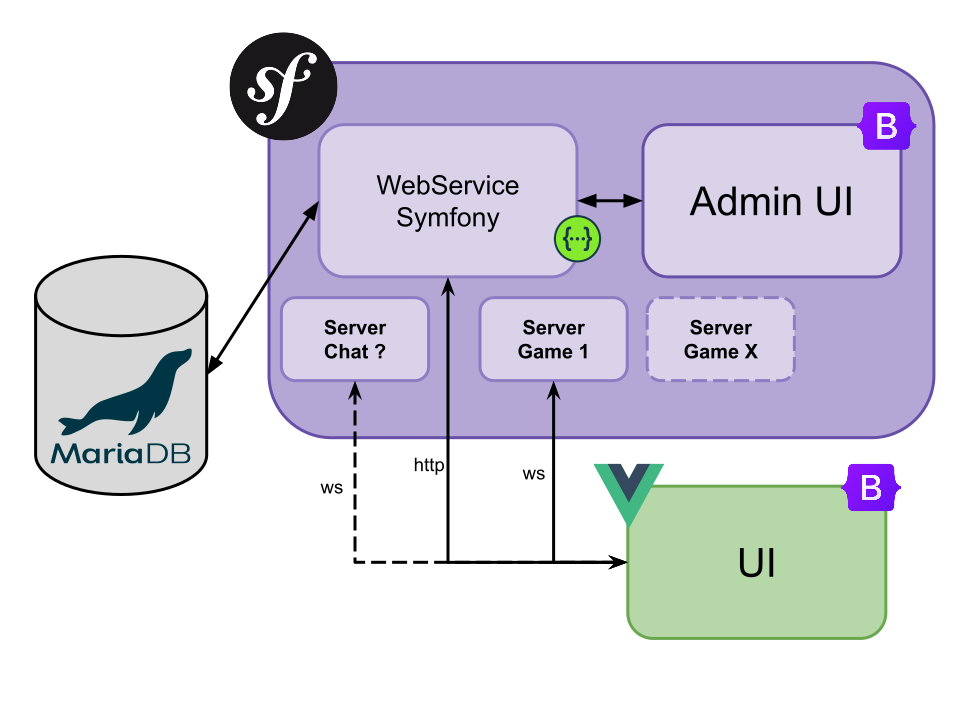

# GeoGuesSUUU

## Requirement

| **name**    | **version** |
|:------------|-------------|
| PHP         | 8.1.11      |
| Symfony CLI | 5.4.19      |
| Composer    | 2.4.4       |

## Install

1. Run `composer install`
2. Copy and rename `.env.example` into `.env`
3. Complete `.env` information :
    - DATABASE_URL
    - JWT_PASSPHRASE
4. Start Symfony project: `symphony serve`

## Architecture

## Port

| **Port** | **Description**      | **Protocol** |
|----------|----------------------|--------------|
| 8000     | WebService + API Doc | HTTP         |
| 8001     | Chat Server          | WebSocket    |
| 9000     | Game - Find The Flag | WebSocket    |

## API Documentation

Go to `http://localhost:8000/api/doc`