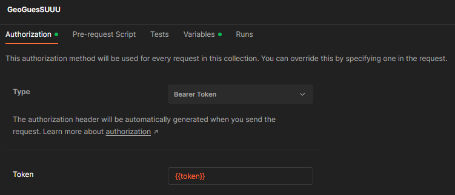

# JWT

## Requirements

Add your pass-phrase in [.env](/.env)

```properties
###> lexik/jwt-authentication-bundle ###
JWT_SECRET_KEY=%kernel.project_dir%/config/jwt/private.pem
JWT_PUBLIC_KEY=%kernel.project_dir%/config/jwt/public.pem
JWT_PASSPHRASE={YOUR_PASSPHRASE}
###< lexik/jwt-authentication-bundle ###
```


## Commands
_*Don't use Windows terminal_

Recommend: GitBash Terminal, Linux Terminal

### Generate Private Key
```shell
openssl genpkey -out config/jwt/private.pem -aes256 -algorithm rsa -pkeyopt rsa_keygen_bits:4096
```

### Generate Public key
```shell
openssl pkey -in config/jwt/private.pem -out config/jwt/public.pem -pubout
```

Found your JWT key in: `/config/jwt/`

## API

### Get token

Send **POST** request to `http://{domaine}/api/token`

with this body :
```json
{
    "username": "your_email",
    "password": "your_password"
}
```

### Send Request

If you try to send a request to the API without a token, it should respond with an HTTP 401 error
```json
{
    "code": 401,
    "message": "JWT Token not found"
}
```

To communicate with the API, you just need to add the token in the header of your request with the keyword Authorization and prefix with Bearer + space

ex:
```
Authorization: Bearer YOUR_TOKEN
```
#### With Postman

With Postman, you can place the token directly in the Authorization tab and select the "Bearer Token" type


